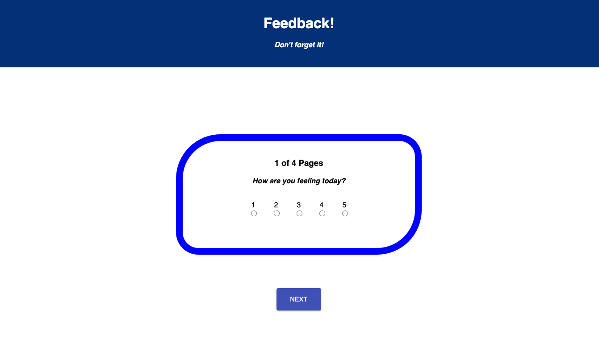
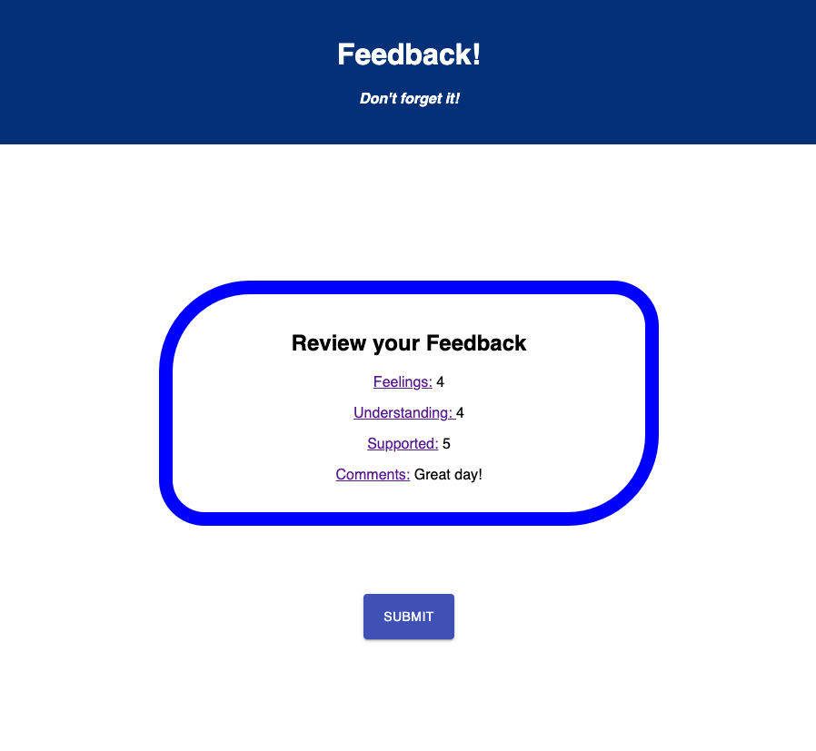
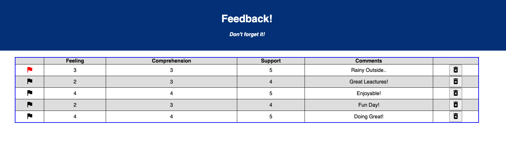

# Weekend-Feedback-Form

## Description

_Duration: 20 Hours_

I created an app that can be used for feedback for how your feeling, your comprehension of content, how well you felt supported, and a spot to leave a comment.

Its set up using for client, server, and database. Using the database to be able to have long term storage for the information.

To see the fully functional site visit : (https://shielded-inlet-46387.herokuapp.com/#/)

## Screen Shot

### Prerequisites
- [Node.js](https://nodejs.org/en/)
- Something to host a database

## Installation

1. Create a database named 'prime_feedback'
2. in data.sql theres commands to create a table and give some sample data
3. npm install
4. npm run server
5. npm run client

## Usage

User
1. Select the number to represent the question 1 being low 5 being high press Next
2. Only the forms with a score is required 
3. You can leave a comment before doing a review and checking submission
4. Once on the review screen if you want to change a score or your comment you can click on the form name to be brought back to that page
5. If it all looks good click submit to send feedback to db
6. If successful you will see a thank you page and a button to leave another piece of feedback if you.

Admin
1. visit localhost:3000/#/admin
2. You can flag feedback items for further review
3. If a feedback item is no longer needed you can press the trash can to delete it from the database

## Built with

React  
Redux  
Node  
Express  
Material UI  
Postgres 
Axios 

## Acknowledgment 
I really would like to thank [Prime Digital Academy](www.primeacademy.io). The amount of support and knowledge that is passed down to us is amazing. 
I would also like to thank my classmates for the support while learning the new tools
My friends and family gets special thanks for the support i get while attending my classes and doing my projects!
